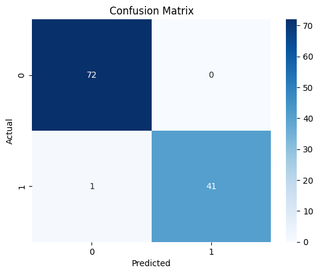
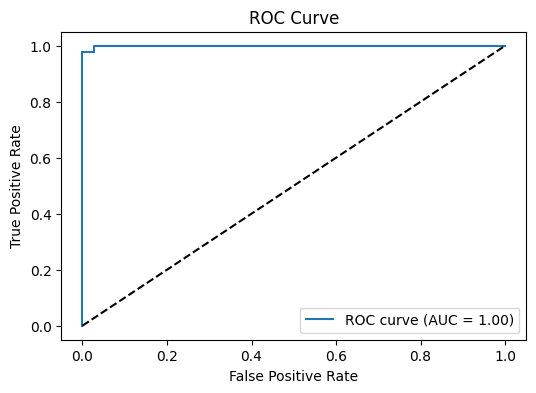
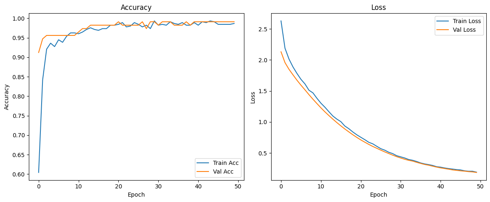

# Breast Cancer Classification with ANN

  
  
  

## 📊 Project Overview

This repository contains a comprehensive pipeline for **diagnosing breast cancer** (benign/malignant) using machine learning and a custom-built **Artificial Neural Network (ANN)**.  
The project walks through all key steps of data analysis, from **data visualization**, **feature engineering**, and **preprocessing**, to **model design**, **training**, and **evaluation** — all with a focus on real-world data science best practices.

---

## 🚀 Features

- **Data Visualization:** Histograms, Boxplots, Scatterplots, and Countplots for EDA.
- **Advanced Feature Engineering:** Shape ratios, statistical differences, composite features, and more.
- **Robust Preprocessing:** Scaling, encoding, and train-test splitting.
- **Custom ANN Model:** Built with TensorFlow/Keras, using Dropout and L2 Regularization to prevent overfitting.
- **Comprehensive Evaluation:** Accuracy, F1-score, Confusion Matrix, ROC-AUC, and training curves.
- **Reproducible & Modular Code:** Well-structured, commented, and easy to extend.

---

## 📈 Results

- **Test Accuracy:** ~99%
- **F1-score:** 0.99 (for both classes)
- **ROC-AUC:** ~1.00
- **Confusion Matrix:** Only 1 misclassification in test set

  
  

- **Training Curves:**

  

---

## 🧠 Model Architecture

- **Input:** Preprocessed numeric features
- **Hidden Layers:** 2 Dense layers (64, 32 units), `ReLU` activation, `HeNormal` initializer, `L2` regularization, `Dropout(0.3)`
- **Output:** Single neuron, `Sigmoid` activation (binary classification)
- **Loss Function:** `binary_crossentropy`
- **Optimizer:** `Adam`

---

## 💡 Key Steps & Decisions

- **Feature Engineering:** Generated shape ratios, worst-mean differences, composite features, and removed redundant columns.
- **Scaling:** Used `StandardScaler` for robust convergence.
- **Regularization:** Combined `Dropout` and `L2` to prevent overfitting.
- **Evaluation:** Used multiple metrics and plots to verify model validity.

---

## 📞 Contact

For any question or collaboration, feel free to open an issue or contact [Moosio Mani](manihk534@gmailcom).

---

## 📜 License

Distributed under the [MIT License](LICENSE).  
Copyright © 2025 [MoosioMani](https://github.com/MoosioMani)

---

## 👤 Author

- [MoosioMani](https://github.com/MoosioMani)

---
